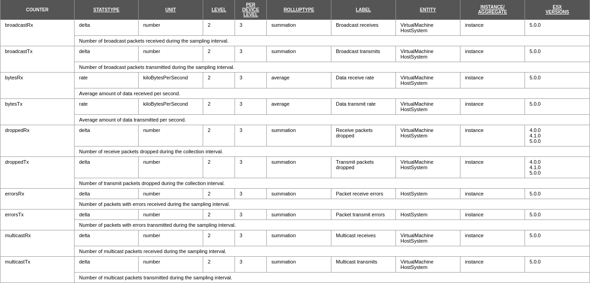
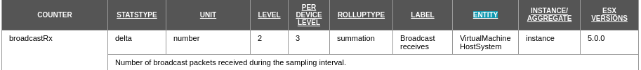
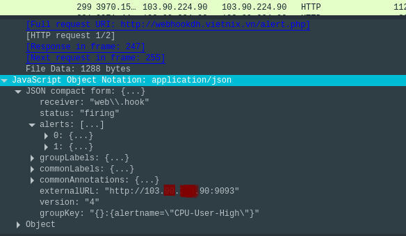
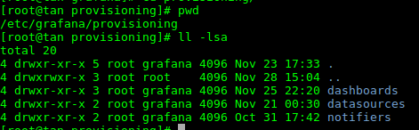

# MONITOR VMWARE SERIES
> Đây là toàn bộ kiến thức của mình về vmware cũng như cách thức mà telegraf dùng vcenter để lấy metric và qui định metric của vcenter. Cấu hình alertmanager cho prometheus, sau đó đẩy qua webhook, dùng nó để đẩy cảnh báo qua các endpoint như telegram, mail, ... 

- Hệ thống sẽ chia làm 2 phần 

- Phần 1 : Monitor 
    ```mermaid
        sequenceDiagram
        participant vCenter
        participant Telegraf
        participant Prometheus
        participant Grafana

        Telegraf->>vCenter : Request metrics
        vCenter->>Telegraf : Send metrics
        Note right of Telegraf: Open Port 9273 for <br/>Prometheus
        Prometheus->>Telegraf : Send request to 9273
        Telegraf->>Prometheus : Send metrics
        Note right of Prometheus : Open Port 9093 for <br/>Grafana
        Grafana->>Prometheus : Send request to 9093
        Prometheus->>Grafana : Send metrics
    ```

- Phần 2 : Alert Manager, xử lý của php.
    - CPU :
        + Nếu CPU > 85% -> cảnh báo bình thường -> lưu vào log -> cuối ngày tổng hợp đẩy lên telegram.
        + Nếu CPU > 95% -> cảnh báo khẩn cấp -> đẩy cảnh báo qua telegram cùng danh sách máy ảo trên host đang bị overload CPU
    
    - RAM : 
        + Nếu RAM > 80% -> cảnh báó cuối ngày
        + Nếu RAM > 95% -> cảnh báo khẩn cấp -> đẩy cảnh báo qua telegram cùng danh sách máy ảo trên host đang bị overload RAM
    - DISK :
        + Nếu free DISK < 100GB -> cảnh báo cuối ngày.

    - NETWORK :
        + Nếu traffic Network trên host > 1GB -> cảnh báo qua telegram và đưa danh sách top 5 VMs có traffic lớn nhất tại thời điểm đó.


- [+] MUC LỤC :
    + TELEGRAF - PLUGIN
    + VCENTER - QUI ĐỊNH CHUNG VỀ METRIC
    + PROMETHEUS - ALERTMANAGER - WEBHOOK - ALERT TELEGRAM
    + GRAFANA - CONVER QUERY FROM INFLUXDB
    + OTHERS

## I [ TELEGRAF - PLUGIN]

- Install telegraf :
    ```Bash
    #Centos
    sudo yum install telegraf

    #Debian
    sudo apt-get install telegraf
    ```

- Các command cơ bản như
    ```bash
    #check syntax file config
    telegraf --test

    #restart service telegraf
    systemctl restart telegraf
    ```

- Telegraf có rất nhiều plugin thì ở đây mình chỉ dùng 2 plugin :
    + vCenter
    + Prometheus

### 1 - Plugin vcenter

- plugin venter là 1 plugin dùng để kết nối vào vcenter để lấy metric về vmware host. Để bật được plugin này thì bạn vào file `/etc/telegraf/telegraf.conf` và tìm cụm từ **vCenter**. Để telegraf lấy được thì bạn cần tạo 1 user_vmaware **monitor** ở vmware host mà bạn muốn lấy metric.
    ```bash
    # # Read metrics from VMware vCenter
    [[inputs.vsphere]]
    #   ## List of vCenter URLs to be monitored. These three lines must be uncommented
    #   ## and edited for the plugin to work.
    vcenters = ["https://192.168.0.1/sdk"]
    username = "monitor@vcenter.vn"
    password = "mypassword"
    ```

- Đối với cấu hình trên khi bạn đặt như vậy thì thằng telegraf sẽ kết nối tới thằng vcenter có IP **192.169.0.1** với user được hiểu là **user_vmware@domain** và **password** mà bạn set cho user đó.
- **Lưu ý :** Bạn có thể lấy metric của nhiều vcenter cùng lúc bằng cách như sau:
    ```bash
    vcenters = ["https://192.168.0.1/sdk","https://192.168.0.2/sdk"]
    username = "monitor@vcenter.vn"
    password = "mypassword"
    ```

- Đối với cấu hình gồm nhiều vcenter như trên thì các vcenter phải dùng thông tin user/password giống nhau.

- Cấu hình lấy metric của các Virtual Machine ( Máy ảo ) trên host, nếu bạn chỉ cần theo dõi trạng thái của host vmware thì không cần cấu hình này và bạn chỉ cần comment lại hết là được.
    ```bash
    #   ## VMs
    #   ## Typical VM metrics (if omitted or empty, all metrics are collected)
    vm_metric_include = [
        "cpu.totalCapacity.average",
        "cpu.usage.average",
        "cpu.usagemhz.average",
        "mem.totalCapacity.average",
        "mem.usage.average",
        "net.bytesRx.average",
        "net.bytesTx.average",
        "net.broadcastRx.summation",
        "net.broadcastTx.summation",
        "net.packetsRx.summation",
        "net.packetsTx.summation",
        "net.usage.average",
        "sys.uptime.latest"
    ]
    #   # vm_metric_exclude = [] ## Nothing is excluded by default
    #   # vm_instances = true ## true by default
    ```

- Cấu hình lấy metric của host system :
    ```bash
    #   ## Hosts
    #   ## Typical host metrics (if omitted or empty, all metrics are collected)
    host_metric_include = [
        "cpu.totalCapacity.average",
        "cpu.usage.average",
        "cpu.usagemhz.average",
        "mem.totalCapacity.average",
        "mem.usage.average",
        "net.bytesRx.average",
        "net.bytesTx.average",
        "net.broadcastRx.summation",
        "net.broadcastTx.summation",
        "net.packetsRx.summation",
        "net.packetsTx.summation",
        "net.usage.average",
        "sys.uptime.latest"
    ]
    #   ## Collect IP addresses? Valid values are "ipv4" and "ipv6"
    #   # ip_addresses = ["ipv6", "ipv4" ]
    #   # host_metric_exclude = [] ## Nothing excluded by default
    #   # host_instances = true ## true by default
    ```

- Cấu hình lấy metric Datastores.
    ```bash
    #   ## Datastores
        datastore_metric_include = ["disk.capacity.latest", "disk.used.latest", "disk.provisioned.latest"] ## if omitted or empty, all metrics are collected
    #   # datastore_metric_exclude = [] ## Nothing excluded by default
    #   # datastore_instances = false ## false by default for Datastores only
    ```
- Tại sao mình lại đề cập về <a name="Datastore"></a>Datastore thì do để monitor được dung lượng ổ cứng của host vmware thì mình cần 3 metric sau:
    + "disk.capacity.latest"
    + "disk.used.latest"
    + "disk.provisioned.latest"
- VM và Host không thể lấy được metric này do **Group disk** không nằm trong phạm vi của VM và Host mà nó được tách ra thành 1 loại metric riêng. ( Phần này mình sẽ nói kỹ hơn ở phần "VCENTER - QUI ĐỊNH CHUNG VỀ METRIC") 

- Trong project của mình chỉ dùng tới 3 thằng là **VM, Host và Datastore** mà plugin vCenter có tất cả là 5 loại là **VM, Host, Cluster, Datastores, Datacenters**. Mình chưa có dùng qua 2 thăng kia nên tạm thời mình không nói tới.

### 2 - Plugin Output.Prometheus_client

- Ở plugin này telegraf sẽ mở port cho Prometheus vào lấy metric. Thì ở đây mình mở port **9273** sau đó ở file cấu hình của prometheus (`/etc/prometheus/prometheus.conf`) mình sẽ cho nó móc vào port này để lấy metric. Lúc này sau khi config xong, link để prometheus vào lấy có định dạng như sau `http://ip:9273/metrics` mặt định là `/metrics` nếu bạn muốn đổi đường dẫn khác thì bạn có thể chỉnh ở phần **path**.
    ```bash
    # Publish all metrics to /metrics for Prometheus to scrape
    [[outputs.prometheus_client]]
    ## Address to listen on.
    listen = ":9273"

    ## Use HTTP Basic Authentication.
    # basic_username = "Foo"
    # basic_password = "Bar"

    ## If set, the IP Ranges which are allowed to access metrics.
    ##   ex: ip_range = ["192.168.0.0/24", "192.168.1.0/30"]
    # ip_range = []

    ## Path to publish the metrics on.
    # path = "/metrics"

    ## Expiration interval for each metric. 0 == no expiration
    # expiration_interval = "60s"

    ## Collectors to enable, valid entries are "gocollector" and "process".
    ## If unset, both are enabled.
    # collectors_exclude = ["gocollector", "process"]

    ## Send string metrics as Prometheus labels.
    ## Unless set to false all string metrics will be sent as labels.
    # string_as_label = true

    ## If set, enable TLS with the given certificate.
    # tls_cert = "/etc/ssl/telegraf.crt"
    # tls_key = "/etc/ssl/telegraf.key"

    ## Set one or more allowed client CA certificate file names to
    ## enable mutually authenticated TLS connections
    # tls_allowed_cacerts = ["/etc/telegraf/clientca.pem"]

    ## Export metric collection time.
    # export_timestamp = false
    ```
- Đối với plugin này thì bạn có thể bảo vệ được metric của mình bằng cách cho phép IP nào được truy cập vào bằng option `ip_range`. Khi option này được kích hoạt thì chỉ có IP hoặc range IP mà bạn khai báo mới được phép truy cập còn các IP khác thì không. Mặt định thì telegraf cho phép tất cả IP được phép truy xuất đến.

## II VCENTER - QUI ĐỊNH CHUNG VỀ METRIC

### 1 - vCenter

- vCenter hay VMware vCenter Server cũng tương tự như Active Directory. Nó cung cấp tiện ích quản lý tập trung cho tất cả máy chủ ESX/ESXi và máy ảo tương ứng của nó. Vì vậy khi telegraf nó móc xuống thằng vCenter thì nó sẽ lấy những thông tin gì và nó lấy bằng cách nào? Thì dưới đây mình sẽ nó rõ hơn cho mọi người hiểu.

- Thứ nhất thằng telegraf dùng plugin vcenter để kết nối xuống database của VMware vCenter Server và phần nó sẽ lấy được ở đây là các thông tin của `PerformanceManager - Performance Counters`.

- `Performance Counters` là thằng cung cấp các dữ liệu về host vmware từ CPU, RAM, DISK, NETWORK và tất nhiện những dữ liệu này nằm ở tầng ảo hóa ( Virtualization ). Các dữ liệu về resource sẽ được gộp thành các group dữ liệu khác nhau như sau:
    + Cluster Service
    + CPU
    + Host-Base Replication
    + Memory
    + Network
    + Power
    + Resource Scheduler
    + Storage Capacity
        + Datastore / Virtual Machine
    + Storage I/O
        + Datastore
        + Disk
        + Virtual Disk
        + Storage Adapter
        + Storage Path
    + System
    + vCenter Resource
    + Virtual Machine Operator

### 2 - Qui định chung về metric

- Mục tiêu project của mình là cần theo dõi trạng thái của 1 host vmware gồm có CPU. RAM, DISK, NETWORK. Các dữ liệu này có 1 cấu trúc giống nhau. Mình xin lấy thằng NETWORK để nói rõ hơn,

- NETWORK - nó là 1 group tập trung các dữ liệu về băng thông, số lượng gói tin truyền tải trên card mạng của các máy ảo (virtual machine - vm) hay trên card mạng thật của host.

    

- Trên bảng này bạn lưu ý cho mình 5 định nghĩa sau (statstype, unit, level, rolluptype, entity) và 5 định nghĩa này cũng qui định cách bạn có thể khai báo ở telegraf để truy xuất xuống hệ thông vcenter và lấy metric mà bạn muốn cũng như thiết lập graph cho phù hợp với từng loại.

- Mình sẽ đi vào giải thích sơ qua 5 định nghĩa này:

    + 1 - Statstype : là cách thức mà vcenter do lường giữa các dữ liệu thu thập được. Nó gồm 3 loại:
        + absolute : so sánh giá trị hiện tại với giá trị ban đầu.
        + delta : so sánh 2 giá trị cuối trong thời gian biểu.
        + rate : tỉ lệ của tổng các lần lấy mẫu với tổng số lần lấy mẫu.

    + 2 - Unit : là đơn vị của metric.

    + 3 - RollupType : giá trị thông kê của các mẫu thử
        + average : Tính trung bình các giá trị được thu thập trong 1 khoảng thời gian lấy mẫu.
        + summation : Tính tổng các giá trị lấy được trong 1 khoảng thời gian lấy mẫu.
        + latest : Giá trị cuối cùng lấy được trong khoảng thời gian lấy mẫu.
        + maximum : Giá trị lớn nhất trong khoảng thời gian lấy mẫu.
        + minimum : Giá trị nhỏ nhất trong khoảng thời gian lấy mẫu.
        + none
    + 4 - Level Ở đây Vcenter nó chia làm 4 cấp độ thu thập metric.
        + cấp 1 : thu thập các metric cơ bản về CPU,RAM,DISK,NETWORK và chỉ tính average
        + cấp 2 : thu thập các metric cơ bản và tính ra "average," "summation," and "latest" thêm vào đó sẽ xuất hiện metric của hệ thống như Uptime, System-Heat và DRS (Distributed Resource Scheduler) dành cho Cluster.
        + cấp 3 : thu thập các metric giống loại 2 và thêm metric dành cho thiết bị.
        + cấp 4 : thu thập các metric giống loại 3 và có thêm giá trị max min
    + 5 - Entity : đây là trường định nghĩa cho mình biết metric đó nằm ở nhóm dữ liệu nào.

- Ví dụ mình muốn lấy metric là BroadcastRx thì mình sẽ đựa vào bản định nghĩa này để cấu trúc lại config của vcenter telegraf.

    

- Đối với định nghĩa trên mình biết metric BroadcastRx có ở nhóm VirtualMachine (VM) và Nhóm HostSystem (Host). Thứ 2 mình thấy metric này thuộc về group Network. Thứ 3 RollupType của nó là summation. Dựa vào 3 thằng này mình sẽ dùng nó để cấu trúc lại config telegraf như sau.

    ```bash
    # # Read metrics from VMware vCenter
    [[inputs.vsphere]]
    #   ## List of vCenter URLs to be monitored. These three lines must be uncommented
    #   ## and edited for the plugin to work.
    vcenters = ["https://192.168.0.1/sdk"]
    username = "monitor@vcenter.vn"
    password = "E1urJ7uu+7kE2UIZ"
    #
    #   ## VMs
    #   ## Typical VM metrics (if omitted or empty, all metrics are collected)
    vm_metric_include = [
        "network.broadcastRx.summation"
    ]
    #   ## Hosts
    #   ## Typical host metrics (if omitted or empty, all metrics are collected)
    host_metric_include = [
        "network.broadcastRx.summation",
    ]
    ```

- Để kiểm tra lại xem config của mình có ổn về mặt cú pháp không thì các bạn chạy câu lệnh sau :

    ```bash
    telegraf --test
    ```

- Sau khi cú pháp ok, thì các bạn tiến hành restart lại service telegraf là được. Bước cuối cùng kiểm tra xem metric đã lấy được hay chưa bằng cách truy xuất đến port mà bạn đã cấu hình listen cho prometheus vào lấy metric.

- Nếu như có metric broadcastRx coi như là thành công. Đây là kết quả của mình.

    ```
    # HELP vsphere_host_net_broadcastRx_summation Telegraf collected metric
    # TYPE vsphere_host_net_broadcastRx_summation untyped
    vsphere_host_net_broadcastRx_summation{dcname="VDC",esxhostname="vmware1.vcenter.vn",host="test.vn",interface="instance-total",moid="host-503",source="vmware1.vcenter.vn",vcenter="192.168.0.1"} 2472
    vsphere_host_net_broadcastRx_summation{dcname="VDC",esxhostname="vmware1.vcenter.vn",host="test.vn",interface="vmnic0",moid="host-503",source="vmware1.vcenter.vn",vcenter="192.168.0.1"} 0
    vsphere_host_net_broadcastRx_summation{dcname="VDC",esxhostname="vmware1.vcener.vn",host="test.vn",interface="vmnic1",moid="host-503",source="vmware1.vcenter.vn",vcenter="192.168.0.1"} 1033
    vsphere_host_net_broadcastRx_summation{dcname="VDC",esxhostname="vmware1.vcenter.vn",host="test.vn",interface="vmnic2",moid="host-503",source="vmware1.vcenter.vn",vcenter="192.168.0.1"} 0
    ```

- Tới đây chắc các ban cũng biết vì sao các metric của Storage mình không khai báo ở VM và Host mà mình đã đề cập [ở trên](#Datastore).

## III - PROMETHEUS - ALERTMANAGER - WEBHOOK - ALERT TELEGRAM

### 1 - Prometheus

- Ở phần này mình sẽ nói về cấu trúc để prometheus kết nối tới telegraf. Mình đã cấu hình cho telegraf mở port listen cho thằng Prometheus ở các bước trên, nên giờ thao tác làm sao định dạng cho Prometheus xuống đúng port là xong. 

- File cấu hình của Prometheus `/etc/prometheus/prometheus.yml`.

- Mình cấu hình đơn giản như thế này thì Prometheus sẽ tự động kết nối tới port 9273 của thằng telegraf. Mình để target là localhost là do telegraf và prometheus đang nằm cùng một máy.
    ```bash
    scrape_configs:
    - job_name: 'data'
        scrape_interval: 5s
        static_configs:
        - targets: ['localhost:9273']
    ```
- Để thêm Alertmanager cho Prometheus thì bạn chị cần thêm cấu trúc sau.
    ```bash
    alerting:
        alertmanagers:
            - static_configs:
                - targets: ['<IP-public>:9093']
    ```
- Cuối cùng là bộ rule cảnh báo, phần này thì bạn dựa vào câu query của Grafana sau đó thêm các thuật toán so sánh là được. Tùy thuộc vào hiện trạng của hệ thống mà mình set bộ rule cho thich hợp.

### 2 - Alertmanager

- Phần config alertmanager này thì bạn lưu ý cho mình là thằng này có vai trò đẩy cảnh báo sang các endpoint như telegram, mail, sms, webhook...


- Ở đây mình cần đẩy thông báo sang telegram và ghi log lại và mình nhận thấy plugin web_hook có thể đảm nhiệm vai trò này nên mình quyết định cấu hình Alertmanager đẩy về web_hook bằng config sau.
    ```bash
    notification_config {
        name: "vmware-alert"
        webhook_config {
            url: "http://localhost:1111/"
            send_resolved: true
        }
    }
    ```
- Tới đây sau khi có cảnh báo thì thông tin đó sẽ đẩy xuống url `http://localhost:1111/` 

### 3 - Web_hook

- Ở đây mình sẽ tạo 1 thằng webservice đơn giản để đón lấy thông tin từ alertmanager đồng thời tạo thêm chức năng đẩy sang telegram và ghi log. Webserver này mình dùng apache chạy php. Tới đây khá đơn giản mình chỉ viết 1 file thực thi php là xong. (Do bài này mình không thiên về code nên mình sẽ không giải thích nhiều cách thức hoạt động của từng hàm)

- Bạn tạo 1 LAMP-STACK rồi cấu hình webservice trước. Sau khi bạn cài đặt và cấu hình DocRoot cho webservice thì bạn tạo 1 file php để xử lý dữ liệu từ alertmanager rồi chuyển qua telegram bằng api của telegram. (Mình sẽ không nói cách cấu hình và cài đặt LAMP-STACK ở bài này).

- Đây là file alert.php của mình, file này chỉ có nhiệm vụ đẩy các alert từ Prometheus sang telegram :
    ```php
    <?php
        $token = "TOKEN-TELEGRAM-BOT";
        $chatid = "CHAT-ID-GROUP";

        date_default_timezone_set('Asia/Ho_Chi_Minh');
        $date = date('Y-m-d H:i:s');

        #GET DATA FROM ALERTMANAGER

        $my_json = file_get_contents('php://input');
        var_dump($my_json);
        $myArray = json_decode($my_json, true);

        #PARSING

        $time     = "[+] Date     : $date" . "\n";
        $status   = "[+] Status   : " . $myArray['status'] . "\n";
        $instance = "[+] Alertname : " . $myArray['groupLabels']['alertname'] . "\n";
        $content  = "";
        foreach ($myArray['alerts'] as $alert){
                $host     = "[+] Host     : " . $alert['labels']['job'] . "\n";
                $detail   = "[+] Detail   : " . $alert['annotations']['description'] . "\n\n";
                $content .= $host . $detail;
        }

        $my_message = $instance  . $content . $status . $time;

        function sendMessage($token, $chatID, $messaggio) {
                echo "sending message to " . $chatID . "\n";
                $url = "https://api.telegram.org/bot" . $token . "/sendMessage?chat_id=" . $chatID;
                $url = $url . "&text=" . urlencode($messaggio);
                $ch = curl_init();
                $optArray = array(
                        CURLOPT_URL => $url,
                        CURLOPT_RETURNTRANSFER => true
                        );
                curl_setopt_array($ch, $optArray);
                $result = curl_exec($ch);
                curl_close($ch);
        return $result;
    ```

- Để biết được mình cần lấy những phần tử nào thì các bạn hãy bắt 1 gói tin được gửi từ alertmanager sẽ thấy được cấu trúc của json, từ đó các bản sẽ biết mình cần lấy những gì.

- Còn đây là 1 gói tin mà mình đã bắt được từ alertmanager gửi đi.


## IV - GRAFANA - CONVER QUERY FROM INFLUXDB - PROVISIONING

### 1 - Convert quey influxDB :

- Ở phần này mình không trình bày kỹ về các kiến thức cơ bản của Grafana cũng như cách chọn và vẽ biểu đồ sao cho hợp lý thì phần này mình xin để dành cho các bài khác nói kỹ hơn, mình sẽ nói về mối tương quan của các câu query giữ 2 thằng database là Prometheus(PromQL) và InfluxDB(SQL).

- Mình có tham khảo link sau : https://www.robustperception.io/translating-between-monitoring-languages

- Mình dựa vào template này và chỉnh lại theo nhu cầu của mình https://grafana.com/grafana/dashboards/8159.

- Trong đây mình đã lấy 1 số câu query được dùng cho influxdb và chuyển nó sang Prometheus.

- Query influxDB :
    ```
    "SELECT last(\"uptime_latest\") FROM \"vsphere_host_sys\" WHERE (\"esxhostname\" =~ /^$esxi$/ 
    AND \"vcenter\" =~ /^$vcenter$/ AND \"clustername\" =~ /^$clustername$/) 
    AND $timeFilter GROUP BY time($__interval) fill(null)"
    ```
    - Đối với câu lệnh query ở trên thì nội dung muốn lấy ra là trường `uptime_time` của table `vsphere_host_sys` theo những trường `exshostname`, `vcenter`, `clustername`

- Query Prometheus tương ứng :
    ```
        vsphere_host_sys_uptime_latest{labelname=~"vmware1.vietnix.vn"}
    ```
    - Đối với Prometheus thì nó gọp lại thành 1 là `vsphere_host_sys_uptime_latest`, trong trường này có chứa các giá trị của `exshostname`, `vcenter`, `clustername` và ở đây mình cần lọc theo giá trị của `exshostname` thôi.

- Cứ như vậy các bạn chỉ cần phân tích xem câu query của infuxDB đang lấy trường nào ở table nào thì chỉ cần qua bên Prometheus gọp tên trường và table lại thôi.

### 2 - Provisioning 

- Grafana có 2 phần, 1 là dashboard và 2 là datasource. Thì đối với mình thì Provisioning có ý nghĩa như thế nào?

- Thứ nhất đối với phần dashboard bạn có thể chỉnh tùy chọn về việc cho phép hay không đối với chỉnh sửa thông qua giao diện web, hoặc việc xóa 1 panel hoặc xóa 1 dashboard.

- Thứ hai đối với datasource mình có thể đảm bảo rằng password của Prometheus sẽ không bị lộ ra ngoài đồng thời cũng khóa chức năng cang thiệp và thay đổi datasoource của grafana thông qua giao diện web.

- Tiếp theo là các bước tiển khai provisioning cho Grafana.

- Đầu tiên bạn sẽ vào thư mục của Gafana và check xem có thư mục dashboard và datasource như hình chưa.


## LINK COLLECT
- 
    + https://github.com/influxdata/telegraf/tree/master/plugins/inputs/prometheus
    + https://computingforgeeks.com/how-to-monitor-vmware-esxi-with-grafana-and-telegraf/

- Using Grafana to show that data - template
    + https://grafana.com/grafana/dashboards/8159

- Metric Vmware - reading for understanding about performance metric
    + https://docs.vmware.com/en/VMware-vSphere/6.5/vsphere-esxi-vcenter-server-65-monitoring-performance-guide.pdf
    + https://www.eginnovations.com/blog/top-10-vmware-performance-metrics/

- Can we get detail resource of each vm in vmware esxi - resource management
    + https://docs.vmware.com/en/VMware-vSphere/6.5/vsphere-esxi-vcenter-server-651-resource-management-guide.pdf

- database provisioning 
    + https://www.novatec-gmbh.de/en/blog/grafana-data-source-provisioning/


# PROMETHEUS
- has 2 file config and 1 folder custom rules:
    + prometheus.yml # config scrape metrics
    + alertmanager.conf # config alertmanager
    + rules 
        + cpu.rule
        + ram.rule
        + disk.rule
        + network.rule